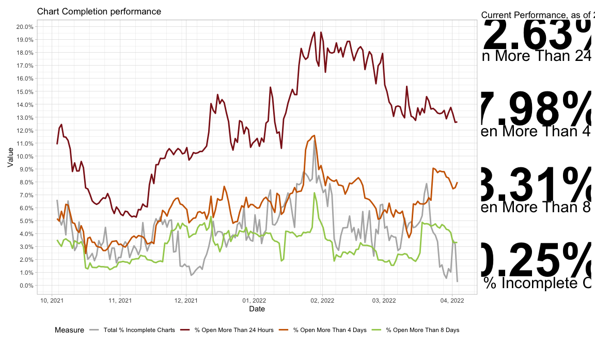
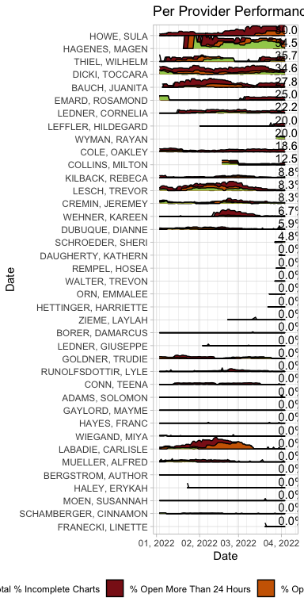
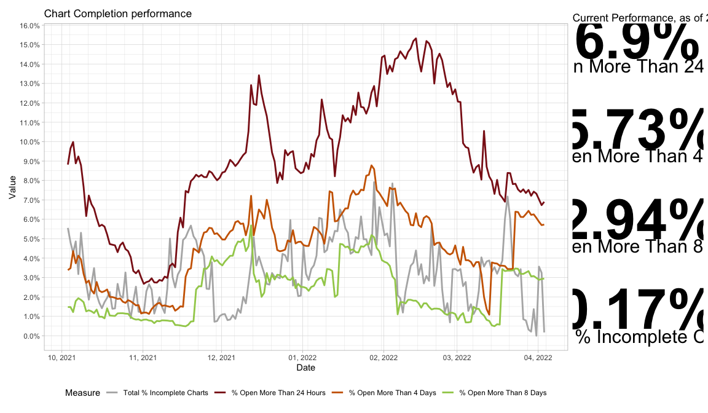

<!-- README.md is generated from README.Rmd. Please edit that file -->

# ChartCompletion

The goal of this project is to visualize chart completion rates over
time and drive understanding of what interventions led to improvements.
For demonstration purposes, all names have been replaced by fictional
names.

## Rationale

Documentation (charts) should be completed in a timely manner, ideally
within 24 hours. Delays in completion result in greater risk for
documentation errors, incomplete information provided for ongoing care,
delays in billing collection, and lost revenue. Staff typically work on
a four day rotation, so the key measures are the percent open more than
24 hours, more than four days, and more than eight days. The numerators
are the number of charts open for each period of time and the
denominator is the number of charts started within the past thirty days.

## Key Visualization

The key visualization charts these rates on a day-by-day basis using
rolling 30-day windows. The graph also highlights the most reecent rate
numbers in individual callout gems on the right. This chart is useful
when correlated with knowledge of external events to understand what
interventions drive significant improvements.

    #> Loading required package: magrittr
    #> ── Attaching core tidyverse packages ──────────────────────── tidyverse 2.0.0 ──
    #> ✔ dplyr     1.1.0     ✔ readr     2.1.4
    #> ✔ forcats   1.0.0     ✔ stringr   1.5.0
    #> ✔ ggplot2   3.4.1     ✔ tibble    3.1.8
    #> ✔ lubridate 1.9.2     ✔ tidyr     1.3.0
    #> ✔ purrr     1.0.1     
    #> ── Conflicts ────────────────────────────────────────── tidyverse_conflicts() ──
    #> ✖ tidyr::extract()   masks magrittr::extract()
    #> ✖ dplyr::filter()    masks stats::filter()
    #> ✖ dplyr::lag()       masks stats::lag()
    #> ✖ purrr::set_names() masks magrittr::set_names()
    #> ℹ Use the ]8;;http://conflicted.r-lib.org/conflicted package]8;; to force all conflicts to become errors
    #> ── Attaching packages ───────────────────────────────────────── groverr 2.0.0 ──
    #> 
    #> ✔ fs        1.6.1     ✔ patchwork 1.1.2
    #> ✔ glue      1.6.2

Looking at individual employees highlights which individuals have
substantially worse performance as well as to understand individual
performance over time. This can be correlated with external events, such
as training periods, times of external stress such as illnesses or
divorces, and individual work loads. An individual with a season of poor
performance correlated with an external stressor that self-resolved is
typically not someone that needs additional help, while an individual
with significant poor performance likely needs help to catch up and
coaching to avoid getting behind in the future.

Using this approach can identify the worst performers, and these can be
removed to get a better sense of the overall performance.

\`\`\`
